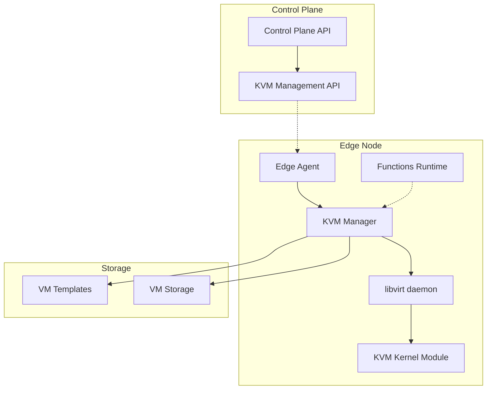

# Design Document: KVM Platform

## Overview

The KVM Platform extends EdgeBase with virtualization capabilities using KVM (Kernel-based Virtual Machine) and libvirt for VM management. This design integrates seamlessly with the existing EdgeBase architecture while providing comprehensive virtual machine lifecycle management, resource control, and security isolation.

The implementation follows EdgeBase's architectural patterns with a new `platform/kvm-manager` service written in Go, leveraging the [digitalocean/go-libvirt](https://github.com/digitalocean/go-libvirt) library for pure Go libvirt integration. This approach maintains consistency with the existing control-plane implementation and provides robust VM management capabilities.

## Architecture



The architecture maintains EdgeBase's distributed design with centralized control and edge execution. The KVM Manager runs as a separate service on each edge node, communicating with the control plane through existing EdgeBase channels.

## Components and Interfaces

### KVM Manager Service

**Location**: `platform/kvm-manager/`
**Language**: Go
**Dependencies**: digitalocean/go-libvirt, existing EdgeBase libraries

**Core Interfaces**:

```go
type VMManager interface {
    CreateVM(ctx context.Context, spec VMSpec) (*VM, error)
    StartVM(ctx context.Context, vmID string) error
    StopVM(ctx context.Context, vmID string, force bool) error
    DeleteVM(ctx context.Context, vmID string) error
    GetVM(ctx context.Context, vmID string) (*VM, error)
    ListVMs(ctx context.Context) ([]*VM, error)
}

type ResourceController interface {
    GetResourceUsage(ctx context.Context) (*ResourceUsage, error)
    ValidateResourceRequest(ctx context.Context, req ResourceRequest) error
    AllocateResources(ctx context.Context, vmID string, req ResourceRequest) error
    ReleaseResources(ctx context.Context, vmID string) error
}

type NetworkManager interface {
    CreateNetwork(ctx context.Context, config NetworkConfig) error
    AssignNetworkToVM(ctx context.Context, vmID string, networkID string) error
    GetNetworkConfig(ctx context.Context, vmID string) (*NetworkConfig, error)
}
```

### Control Plane Integration

**Location**: `platform/control-plane/internal/handler/kvm/`

New HTTP handlers for KVM management:
- `POST /api/v1/nodes/{nodeId}/vms` - Create VM
- `GET /api/v1/nodes/{nodeId}/vms` - List VMs
- `GET /api/v1/nodes/{nodeId}/vms/{vmId}` - Get VM details
- `POST /api/v1/nodes/{nodeId}/vms/{vmId}/start` - Start VM
- `POST /api/v1/nodes/{nodeId}/vms/{vmId}/stop` - Stop VM
- `DELETE /api/v1/nodes/{nodeId}/vms/{vmId}` - Delete VM

### Edge Node Integration

The KVM Manager integrates with existing edge node components:
- **Registration**: Extends node registration to include KVM capabilities
- **Heartbeat**: Includes VM status in heartbeat messages
- **Resource Reporting**: Reports VM resource usage alongside function metrics

## Data Models

### VM Specification

```go
type VMSpec struct {
    Name        string            `json:"name"`
    TemplateID  string            `json:"template_id"`
    Resources   ResourceRequest   `json:"resources"`
    Network     NetworkConfig     `json:"network"`
    Storage     StorageConfig     `json:"storage"`
    Metadata    map[string]string `json:"metadata"`
}

type ResourceRequest struct {
    CPUCores   int    `json:"cpu_cores"`
    MemoryMB   int    `json:"memory_mb"`
    DiskGB     int    `json:"disk_gb"`
}

type NetworkConfig struct {
    Mode       string   `json:"mode"` // "bridged", "nat", "isolated"
    Interfaces []string `json:"interfaces"`
    IPAddress  string   `json:"ip_address,omitempty"`
}
```

### VM Instance

```go
type VM struct {
    ID          string            `json:"id"`
    NodeID      string            `json:"node_id"`
    Name        string            `json:"name"`
    Status      VMStatus          `json:"status"`
    Resources   ResourceRequest   `json:"resources"`
    Network     NetworkConfig     `json:"network"`
    CreatedAt   time.Time         `json:"created_at"`
    UpdatedAt   time.Time         `json:"updated_at"`
    Metadata    map[string]string `json:"metadata"`
}

type VMStatus string

const (
    VMStatusCreating VMStatus = "creating"
    VMStatusStopped  VMStatus = "stopped"
    VMStatusRunning  VMStatus = "running"
    VMStatusPaused   VMStatus = "paused"
    VMStatusError    VMStatus = "error"
)
```

### VM Template

```go
type VMTemplate struct {
    ID          string            `json:"id"`
    Name        string            `json:"name"`
    Version     string            `json:"version"`
    OSType      string            `json:"os_type"`
    ImagePath   string            `json:"image_path"`
    MinResources ResourceRequest  `json:"min_resources"`
    Metadata    map[string]string `json:"metadata"`
    CreatedAt   time.Time         `json:"created_at"`
}
```

Now I need to use the prework tool to analyze the acceptance criteria before writing the Correctness Properties section:

<function_calls>
<invoke name="prework">
<parameter name="featureName">kvm-platform

## Correctness Properties

*A property is a characteristic or behavior that should hold true across all valid executions of a system—essentially, a formal statement about what the system should do. Properties serve as the bridge between human-readable specifications and machine-verifiable correctness guarantees.*

Based on the prework analysis and property reflection, the following properties validate the KVM platform's correctness:

### Property 1: VM Creation Consistency
*For any* valid VM specification, creating a VM should produce a VM instance with resources, network configuration, and metadata that exactly match the specification.
**Validates: Requirements 1.1, 1.4**

### Property 2: Resource Validation and Enforcement
*For any* resource request, the Resource Controller should reject requests that exceed available resources and enforce limits for all allocated VMs.
**Validates: Requirements 1.2, 3.2, 3.3**

### Property 3: VM Lifecycle State Transitions
*For any* VM instance, state transitions (create→stopped→running→stopped→deleted) should follow valid sequences and maintain state consistency.
**Validates: Requirements 2.1, 2.2, 2.4, 2.5**

### Property 4: Resource Cleanup on Failure
*For any* failed VM operation, all partially allocated resources should be cleaned up and returned to the available resource pool.
**Validates: Requirements 1.5, 2.5**

### Property 5: VM Isolation Boundaries
*For any* pair of VM instances, each VM should be completely isolated from the other in terms of processes, memory, and filesystem access.
**Validates: Requirements 5.1, 5.2, 5.3**

### Property 6: Network Configuration Validation
*For any* network configuration request, the Network Manager should validate settings, prevent conflicts, and apply changes without affecting other VMs.
**Validates: Requirements 4.1, 4.3, 4.5**

### Property 7: Network Mode Support
*For any* VM with bridged or NAT network mode, the VM should have appropriate network connectivity according to the specified mode.
**Validates: Requirements 4.2, 4.4**

### Property 8: EdgeBase Integration Consistency
*For any* KVM platform operation, authentication, configuration, and status reporting should use existing EdgeBase mechanisms without conflicts.
**Validates: Requirements 6.1, 6.2, 6.3, 6.4, 6.5**

### Property 9: Template Management Round-trip
*For any* valid VM template, storing then retrieving the template should produce an equivalent template with verified integrity.
**Validates: Requirements 7.1, 7.3**

### Property 10: Template Cloning Consistency
*For any* VM template, creating multiple VMs from the same template should produce VMs with identical base configurations.
**Validates: Requirements 7.2**

### Property 11: Resource Monitoring Completeness
*For any* VM instance, resource monitoring should collect all required metrics (CPU, memory, I/O) and status information.
**Validates: Requirements 3.1, 8.1, 8.4**

### Property 12: Event Logging Completeness
*For any* VM lifecycle event or error condition, the system should log detailed information including timestamps and context.
**Validates: Requirements 8.2, 8.3**

### Property 13: Security Access Control
*For any* unauthorized resource access attempt by a VM, the system should block the access and log the security violation.
**Validates: Requirements 5.4**

### Property 14: Dynamic Resource Adjustment
*For any* running VM with adjustable resources, dynamic resource changes should be applied without affecting VM operation or other VMs.
**Validates: Requirements 3.5**

### Property 15: Template Versioning Consistency
*For any* VM template with multiple versions, version management should maintain proper ordering and allow rollback to previous versions.
**Validates: Requirements 7.4**

## Error Handling

The KVM platform implements comprehensive error handling following EdgeBase patterns:

### Error Categories

1. **Resource Errors**: Insufficient CPU, memory, or storage
2. **Network Errors**: Configuration conflicts, connectivity issues
3. **Template Errors**: Invalid templates, integrity failures
4. **Integration Errors**: EdgeBase communication failures
5. **Security Errors**: Unauthorized access attempts
6. **System Errors**: libvirt/KVM failures

### Error Response Format

```go
type KVMError struct {
    Code      string            `json:"code"`
    Message   string            `json:"message"`
    Details   map[string]string `json:"details"`
    Timestamp time.Time         `json:"timestamp"`
}
```

### Error Handling Strategies

- **Graceful Degradation**: Continue operation when possible
- **Resource Cleanup**: Always clean up on failures
- **Detailed Logging**: Capture context for troubleshooting
- **User Feedback**: Provide actionable error messages
- **Retry Logic**: Implement exponential backoff for transient errors

## Testing Strategy

### Dual Testing Approach

The KVM platform uses both unit tests and property-based tests for comprehensive coverage:

**Unit Tests**:
- Specific examples demonstrating correct behavior
- Edge cases and error conditions
- Integration points between components
- Mock-based isolation testing

**Property Tests**:
- Universal properties across all inputs
- Comprehensive input coverage through randomization
- Minimum 100 iterations per property test
- Each test references its design document property

### Property-Based Testing Configuration

Using [Testify](https://github.com/stretchr/testify) for Go unit tests and [gopter](https://github.com/leanovate/gopter) for property-based testing:

```go
// Example property test structure
func TestVMCreationConsistency(t *testing.T) {
    // Feature: kvm-platform, Property 1: VM Creation Consistency
    properties := gopter.NewProperties(nil)
    properties.Property("VM creation matches specification", 
        prop.ForAll(testVMCreationConsistency, genVMSpec()))
    properties.TestingRun(t, gopter.ConsoleReporter(false))
}
```

### Test Categories

1. **VM Lifecycle Tests**: Creation, startup, shutdown, deletion
2. **Resource Management Tests**: Allocation, validation, cleanup
3. **Network Configuration Tests**: Mode support, isolation, validation
4. **Security Tests**: Isolation, access control, template integrity
5. **Integration Tests**: EdgeBase compatibility, communication
6. **Performance Tests**: Resource usage, scalability limits

### Testing Infrastructure

- **Mock libvirt**: For unit testing without actual VMs
- **Test VMs**: Lightweight VMs for integration testing
- **Resource Simulation**: Mock resource constraints
- **Network Simulation**: Test network configurations
- **Error Injection**: Simulate failure conditions

The testing strategy ensures both correctness through property validation and reliability through comprehensive edge case coverage.