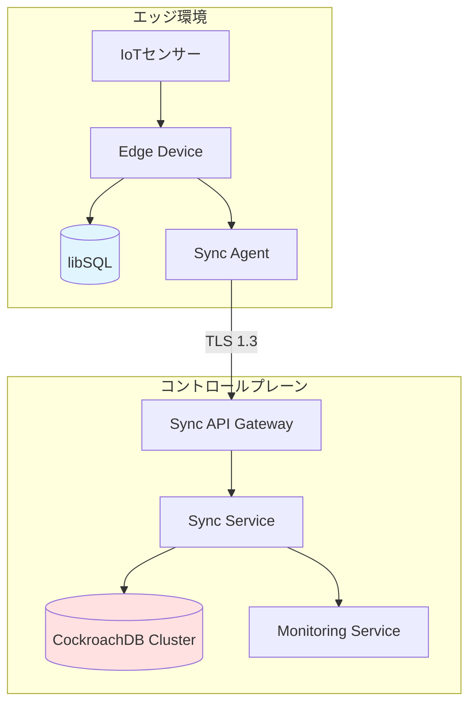
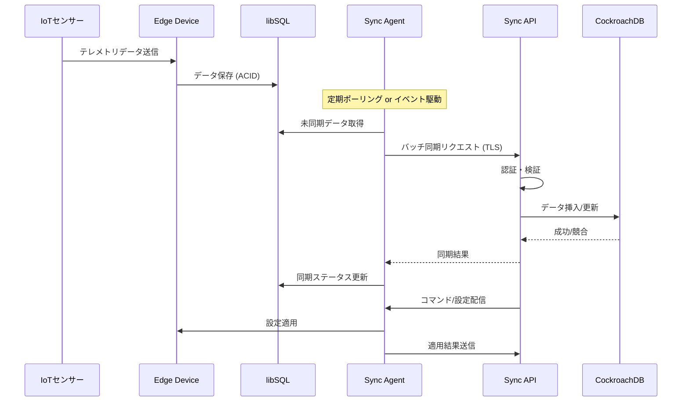

# 設計書

## 概要

IoTデータ同期システムは、エッジデバイス上のlibSQLとコントロールプレーンのCockroachDBの間で双方向のデータ同期を実現します。エッジデバイスはオフライン時でもデータを収集し、接続回復時に自動的に同期します。システムは競合解決、セキュリティ、スケーラビリティを考慮した設計となっています。

## アーキテクチャ

### システム構成図



### アーキテクチャの主要コンポーネント

1. **エッジ層**
   - IoTセンサー: データ生成源
   - Edge Device: データ収集とローカル処理
   - libSQL: エッジでの軽量データベース
   - Sync Agent: 同期ロジックの実行

2. **コントロールプレーン層**
   - Sync API Gateway: エッジデバイスからのリクエスト受付
   - Sync Service: 同期ロジックとビジネスルール
   - CockroachDB: 分散データストレージ
   - Monitoring Service: メトリクスと監視

### データフロー



## コンポーネントとインターフェース

### 1. Edge Device (エッジデバイス)

#### 責務
- IoTセンサーからのデータ収集
- libSQLへのローカルデータ保存
- Sync Agentの実行環境提供

#### 主要インターフェース
```typescript
interface EdgeDevice {
  collectTelemetry(sensorId: string, data: TelemetryData): Promise<void>;
  getLocalDatabase(): LibSQLConnection;
  applyConfiguration(config: DeviceConfiguration): Promise<ApplyResult>;
}
```

### 2. Sync Agent (同期エージェント)

#### 責務
- エッジとコントロールプレーン間の同期調整
- 接続管理とリトライロジック
- 競合検出と解決
- 同期状態の追跡

#### 主要インターフェース
```typescript
interface SyncAgent {
  // アップストリーム同期
  syncToControlPlane(): Promise<SyncResult>;
  getPendingRecords(limit: number): Promise<TelemetryRecord[]>;
  markAsSynced(recordIds: string[], syncTimestamp: Date): Promise<void>;
  
  // ダウンストリーム同期
  pollCommands(): Promise<Command[]>;
  applyCommand(command: Command): Promise<CommandResult>;
  
  // 接続管理
  establishConnection(): Promise<Connection>;
  healthCheck(): Promise<HealthStatus>;
}
```

#### 同期戦略
- **ポーリング間隔**: デフォルト30秒、設定可能
- **バッチサイズ**: 1回の同期で最大1000レコード
- **リトライポリシー**: 指数バックオフ (初期1秒、最大5回)
- **接続プール**: 最大5接続を維持

### 3. Sync API Gateway

#### 責務
- エッジデバイスからのリクエスト受付
- 認証と認可
- レート制限
- リクエストルーティング

#### エンドポイント設計
```
POST   /api/v1/sync/telemetry        # テレメトリデータ同期
GET    /api/v1/sync/commands/:deviceId # コマンド取得
POST   /api/v1/sync/ack/:commandId    # コマンド確認応答
GET    /api/v1/sync/status/:deviceId  # 同期ステータス取得
POST   /api/v1/devices/register       # デバイス登録
```

#### 認証方式
- **mTLS (Mutual TLS)**: 証明書ベースの相互認証
- **API Token**: JWT形式のトークン認証（フォールバック）
- **デバイスID**: 各エッジデバイスに一意のID割り当て

### 4. Sync Service

#### 責務
- ビジネスロジックの実行
- データ変換とバリデーション
- 競合解決の実行
- CockroachDBとのインタラクション

#### 主要インターフェース
```typescript
interface SyncService {
  processTelemetryBatch(batch: TelemetryBatch): Promise<BatchResult>;
  resolveConflict(local: Record, remote: Record): Promise<Record>;
  publishCommand(deviceId: string, command: Command): Promise<void>;
  getDeviceSyncStatus(deviceId: string): Promise<SyncStatus>;
}
```

## データモデル

### libSQL スキーマ (エッジ)

```sql
-- テレメトリデータテーブル
CREATE TABLE telemetry_data (
  id TEXT PRIMARY KEY,
  device_id TEXT NOT NULL,
  sensor_id TEXT NOT NULL,
  timestamp INTEGER NOT NULL,
  data_type TEXT NOT NULL,
  value REAL NOT NULL,
  unit TEXT,
  metadata TEXT, -- JSON形式
  sync_status TEXT DEFAULT 'pending', -- pending, syncing, synced, failed
  sync_timestamp INTEGER,
  version INTEGER DEFAULT 1,
  created_at INTEGER DEFAULT (strftime('%s', 'now'))
);

CREATE INDEX idx_sync_status ON telemetry_data(sync_status, timestamp);
CREATE INDEX idx_device_sensor ON telemetry_data(device_id, sensor_id, timestamp);

-- デバイス設定テーブル
CREATE TABLE device_config (
  id TEXT PRIMARY KEY,
  config_key TEXT NOT NULL UNIQUE,
  config_value TEXT NOT NULL,
  version INTEGER NOT NULL,
  applied_at INTEGER,
  received_at INTEGER NOT NULL
);

-- コマンドキューテーブル
CREATE TABLE command_queue (
  id TEXT PRIMARY KEY,
  command_type TEXT NOT NULL,
  payload TEXT NOT NULL, -- JSON形式
  status TEXT DEFAULT 'pending', -- pending, executing, completed, failed
  received_at INTEGER NOT NULL,
  executed_at INTEGER,
  result TEXT
);

-- 同期ログテーブル
CREATE TABLE sync_log (
  id TEXT PRIMARY KEY,
  sync_type TEXT NOT NULL, -- upstream, downstream
  started_at INTEGER NOT NULL,
  completed_at INTEGER,
  records_count INTEGER,
  status TEXT NOT NULL, -- success, partial, failed
  error_message TEXT
);
```

### CockroachDB スキーマ (コントロールプレーン)

```sql
-- デバイステーブル
CREATE TABLE devices (
  device_id UUID PRIMARY KEY DEFAULT gen_random_uuid(),
  device_name TEXT NOT NULL,
  device_type TEXT NOT NULL,
  location TEXT,
  registered_at TIMESTAMPTZ DEFAULT now(),
  last_seen_at TIMESTAMPTZ,
  status TEXT DEFAULT 'active', -- active, inactive, offline
  metadata JSONB
);

-- テレメトリデータテーブル（時系列最適化）
CREATE TABLE telemetry_data (
  id UUID PRIMARY KEY DEFAULT gen_random_uuid(),
  device_id UUID NOT NULL REFERENCES devices(device_id),
  sensor_id TEXT NOT NULL,
  timestamp TIMESTAMPTZ NOT NULL,
  data_type TEXT NOT NULL,
  value DOUBLE PRECISION NOT NULL,
  unit TEXT,
  metadata JSONB,
  version INT DEFAULT 1,
  synced_at TIMESTAMPTZ DEFAULT now(),
  INDEX idx_device_time (device_id, timestamp DESC),
  INDEX idx_sensor_time (sensor_id, timestamp DESC)
) WITH (ttl_expire_after = '90 days'); -- 90日後に自動削除

-- コマンドテーブル
CREATE TABLE commands (
  command_id UUID PRIMARY KEY DEFAULT gen_random_uuid(),
  device_id UUID NOT NULL REFERENCES devices(device_id),
  command_type TEXT NOT NULL,
  payload JSONB NOT NULL,
  status TEXT DEFAULT 'pending', -- pending, delivered, executed, failed
  created_at TIMESTAMPTZ DEFAULT now(),
  delivered_at TIMESTAMPTZ,
  executed_at TIMESTAMPTZ,
  result JSONB,
  INDEX idx_device_status (device_id, status, created_at)
);

-- デバイス設定テーブル
CREATE TABLE device_configs (
  config_id UUID PRIMARY KEY DEFAULT gen_random_uuid(),
  device_id UUID NOT NULL REFERENCES devices(device_id),
  config_key TEXT NOT NULL,
  config_value JSONB NOT NULL,
  version INT NOT NULL,
  created_at TIMESTAMPTZ DEFAULT now(),
  UNIQUE (device_id, config_key)
);

-- 同期ステータステーブル
CREATE TABLE sync_status (
  device_id UUID PRIMARY KEY REFERENCES devices(device_id),
  last_sync_at TIMESTAMPTZ,
  last_sync_status TEXT, -- success, failed
  pending_records_count INT DEFAULT 0,
  total_synced_records BIGINT DEFAULT 0,
  last_error TEXT,
  updated_at TIMESTAMPTZ DEFAULT now()
);

-- 競合ログテーブル
CREATE TABLE conflict_log (
  conflict_id UUID PRIMARY KEY DEFAULT gen_random_uuid(),
  device_id UUID NOT NULL REFERENCES devices(device_id),
  record_id TEXT NOT NULL,
  conflict_type TEXT NOT NULL,
  local_value JSONB,
  remote_value JSONB,
  resolved_value JSONB,
  resolution_strategy TEXT,
  detected_at TIMESTAMPTZ DEFAULT now()
);
```

### データ型定義

```typescript
interface TelemetryData {
  id: string;
  deviceId: string;
  sensorId: string;
  timestamp: Date;
  dataType: string;
  value: number;
  unit?: string;
  metadata?: Record<string, any>;
  version: number;
}

interface SyncStatus {
  deviceId: string;
  lastSyncAt?: Date;
  lastSyncStatus: 'success' | 'failed';
  pendingRecordsCount: number;
  totalSyncedRecords: number;
  lastError?: string;
}

interface Command {
  commandId: string;
  deviceId: string;
  commandType: string;
  payload: Record<string, any>;
  status: 'pending' | 'delivered' | 'executed' | 'failed';
  createdAt: Date;
}

interface ConflictResolution {
  conflictId: string;
  deviceId: string;
  recordId: string;
  conflictType: string;
  localValue: any;
  remoteValue: any;
  resolvedValue: any;
  resolutionStrategy: 'last-write-wins' | 'custom';
}
```

## エラーハンドリング

### エラー分類

1. **ネットワークエラー**
   - 接続タイムアウト
   - DNS解決失敗
   - TLS/SSL エラー
   - **対応**: 指数バックオフでリトライ、最大5回

2. **認証エラー**
   - 証明書検証失敗
   - トークン期限切れ
   - 権限不足
   - **対応**: エラーログ記録、管理者通知、同期停止

3. **データエラー**
   - バリデーション失敗
   - スキーマ不一致
   - データ型エラー
   - **対応**: 該当レコードをスキップ、エラーログ記録、続行

4. **競合エラー**
   - バージョン競合
   - 同時更新競合
   - **対応**: 競合解決戦略適用、ログ記録

5. **リソースエラー**
   - ディスク容量不足
   - メモリ不足
   - 接続プール枯渇
   - **対応**: アラート生成、同期一時停止、リソース解放待機

### エラーハンドリング戦略

```typescript
interface ErrorHandler {
  handleNetworkError(error: NetworkError): RetryDecision;
  handleAuthError(error: AuthError): void;
  handleDataError(error: DataError, record: any): void;
  handleConflict(conflict: Conflict): Resolution;
  handleResourceError(error: ResourceError): void;
}

interface RetryDecision {
  shouldRetry: boolean;
  delayMs: number;
  maxAttempts: number;
}
```

### リトライポリシー

```typescript
const retryPolicy = {
  initialDelayMs: 1000,
  maxDelayMs: 60000,
  multiplier: 2,
  maxAttempts: 5,
  retryableErrors: [
    'NETWORK_TIMEOUT',
    'CONNECTION_REFUSED',
    'TEMPORARY_FAILURE'
  ]
};
```

## テスト戦略

### 1. ユニットテスト
- **対象**: 各コンポーネントの個別機能
- **ツール**: Jest / Vitest
- **カバレッジ目標**: 80%以上
- **重点領域**:
  - データ変換ロジック
  - 競合解決アルゴリズム
  - バリデーション関数
  - リトライロジック

### 2. 統合テスト
- **対象**: コンポーネント間の連携
- **シナリオ**:
  - エッジからコントロールプレーンへの同期フロー
  - コマンド配信と実行フロー
  - 競合発生時の解決フロー
  - 認証・認可フロー

### 3. エンドツーエンドテスト
- **対象**: システム全体の動作
- **シナリオ**:
  - オフライン→オンライン遷移時の同期
  - 大量データの同期性能
  - 複数デバイスの同時同期
  - ネットワーク障害からの回復

### 4. 性能テスト
- **負荷テスト**: 10,000デバイスの同時接続
- **スループットテスト**: 1デバイスあたり100レコード/秒
- **レイテンシテスト**: 同期完了まで5秒以内（通常時）

### 5. セキュリティテスト
- TLS設定の検証
- 証明書検証の確認
- 認証バイパステスト
- データ暗号化の確認

## セキュリティ考慮事項

### 1. 通信セキュリティ
- TLS 1.3 必須
- 証明書ピンニング（オプション）
- 相互TLS認証

### 2. 認証・認可
- デバイス証明書ベースの認証
- JWTトークンによるセッション管理
- ロールベースアクセス制御（RBAC）

### 3. データ保護
- 転送中: TLS暗号化
- 保存時: libSQL/CockroachDB の暗号化機能利用
- 機密データのマスキング

### 4. 監査ログ
- すべての同期操作をログ記録
- 認証試行の記録
- 設定変更の追跡

## スケーラビリティ設計

### エッジ側
- libSQLの軽量性を活用
- ローカルキャッシュによる負荷軽減
- バッチ処理による効率化

### コントロールプレーン側
- CockroachDBの水平スケーリング
- 読み取りレプリカの活用
- 接続プーリングとロードバランシング
- 時系列データの自動パーティショニング

### 監視メトリクス
- 同期レイテンシ
- 未同期レコード数
- エラー率
- スループット
- 接続数
- CockroachDB クラスタヘルス

## デプロイメント考慮事項

### エッジデバイス
- コンテナ化（Docker）またはバイナリ配布
- 自動更新メカニズム
- ロールバック機能

### コントロールプレーン
- Kubernetes上でのデプロイ
- CockroachDB クラスタ構成（最小3ノード）
- 高可用性構成
- 自動スケーリング設定

## 今後の拡張性

- リアルタイムストリーミング同期（WebSocket）
- エッジでの軽量分析機能
- マルチリージョン対応
- カスタム競合解決ルールエンジン
- GraphQL APIサポート
