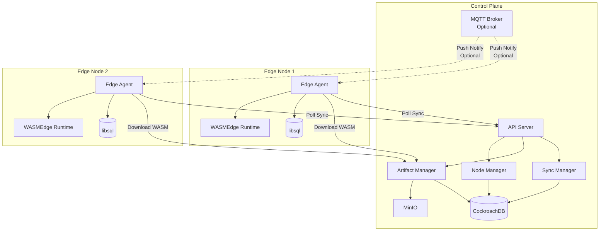
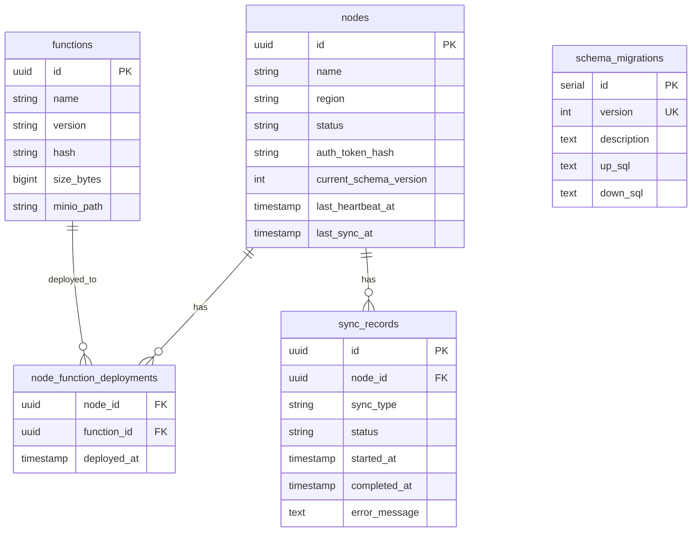

# 設計書

## 概要

エッジ同期コントロールプレーンは、分散エッジノード上のlibsqlデータベースとWASMEdge関数を中央から管理・同期するシステムです。コントロールプレーンはCockroachDBでメタデータを管理し、MinIOでWASMアーティファクトを保存します。エッジノードはポーリングベースで同期を行い、最終的な整合性を保証します。

## アーキテクチャ

### システム構成図



### アーキテクチャ決定

1. **ハイブリッド同期モデル**: 
   - **プライマリ: ポーリングベース** - エッジノードが定期的にコントロールプレーンをポーリング。ファイアウォール越えの問題を回避し、エッジノードの自律性を保つ
   - **オプション: MQTTプッシュ通知** - 即座の同期が必要な場合、MQTTでエッジノードに通知を送信し、即座にポーリングをトリガー

2. **最終的整合性**: 即座の同期を保証せず、最終的にすべてのエッジノードが同じ状態に収束することを目指す

3. **イミュータブルアーティファクト**: WASMバイナリは一度作成されたら変更されず、新しいバージョンとして管理される

4. **ステートフル同期**: 各エッジノードの現在の状態を追跡し、差分のみを配信する

### 同期方式の比較

| 方式 | メリット | デメリット | 推奨ケース |
|------|---------|-----------|-----------|
| **ポーリング** | ・ファイアウォール越えが容易<br>・実装がシンプル<br>・エッジノードの自律性が高い | ・リアルタイム性が低い<br>・無駄なポーリングが発生 | ・ネットワーク制約が厳しい<br>・同期遅延が許容できる |
| **MQTT** | ・リアルタイム通知<br>・軽量プロトコル<br>・双方向通信 | ・ブローカーの運用が必要<br>・接続維持のオーバーヘッド | ・即座の同期が必要<br>・安定したネットワーク |
| **メッセージキュー<br>(NATS/RabbitMQ)** | ・信頼性の高い配信<br>・スケーラビリティ<br>・再送機能 | ・インフラが複雑<br>・運用コストが高い | ・大規模環境<br>・高い信頼性が必要 |

### 推奨アーキテクチャ: ハイブリッドモデル

**基本動作（ポーリング）:**
- エッジノードは30秒ごとにポーリング
- ネットワーク障害に強い
- 実装がシンプル

**オプション機能（MQTT通知）:**
- 緊急の同期が必要な場合にMQTTで通知
- エッジノードは通知を受けたら即座にポーリング
- MQTTブローカーが利用できない場合でも動作継続

この設計により、シンプルさと柔軟性を両立します。

## コンポーネントとインターフェース

### 1. API Server

コントロールプレーンのエントリーポイント。REST APIを提供します。

**主要エンドポイント:**

```
POST   /api/v1/nodes/register          - エッジノード登録
POST   /api/v1/nodes/{id}/heartbeat    - ヘルスチェック
GET    /api/v1/nodes/{id}/sync         - 同期情報取得
POST   /api/v1/nodes/{id}/sync/ack     - 同期完了通知

POST   /api/v1/functions               - WASM関数アップロード
GET    /api/v1/functions/{id}          - WASM関数メタデータ取得
GET    /api/v1/functions/{id}/download - WASMバイナリダウンロード
DELETE /api/v1/functions/{id}          - WASM関数削除

POST   /api/v1/schemas                 - スキーマ変更登録
GET    /api/v1/schemas                 - スキーマ変更一覧取得
```

**技術スタック:** Go + Gin または Rust + Axum

### 2. Node Manager

エッジノードのライフサイクルと状態を管理します。

**責務:**
- エッジノードの登録と認証情報発行
- ノード状態の追跡（オンライン/オフライン/同期中）
- ヘルスチェックの処理
- ノードメタデータの管理

**インターフェース:**

```go
type NodeManager interface {
    RegisterNode(ctx context.Context, req RegisterRequest) (*Node, error)
    UpdateHeartbeat(ctx context.Context, nodeID string) error
    GetNode(ctx context.Context, nodeID string) (*Node, error)
    ListNodes(ctx context.Context, filter NodeFilter) ([]*Node, error)
    UpdateNodeStatus(ctx context.Context, nodeID string, status NodeStatus) error
}
```

### 3. Sync Manager

エッジノードとの同期ロジックを管理します。

**責務:**
- エッジノードの現在状態とターゲット状態の比較
- 配信すべきWASM関数とスキーマ変更の決定
- 同期トランザクションの管理
- 同期履歴の記録

**インターフェース:**

```go
type SyncManager interface {
    GetSyncPlan(ctx context.Context, nodeID string, currentState NodeState) (*SyncPlan, error)
    AcknowledgeSync(ctx context.Context, nodeID string, syncID string, result SyncResult) error
    GetSyncHistory(ctx context.Context, nodeID string, limit int) ([]*SyncRecord, error)
}
```

**同期アルゴリズム:**

```
1. エッジノードから現在の状態を受信
   - デプロイ済みWASM関数のリスト（名前、バージョン、ハッシュ）
   - 現在のスキーマバージョン

2. ターゲット状態を取得
   - 最新のWASM関数デプロイメント設定
   - 最新のスキーマバージョン

3. 差分を計算
   - 追加すべきWASM関数
   - 削除すべきWASM関数
   - 適用すべきスキーマ変更

4. 同期プランを返す
   - 実行順序付きのアクション一覧
   - 各アクションのダウンロードURL

5. エッジノードから完了通知を受信
   - 成功/失敗ステータス
   - エラー詳細（失敗時）
   - 新しい現在状態
```

### 4. Artifact Manager

WASMバイナリの保存と配信を管理します。

**責務:**
- WASMバイナリのMinIOへのアップロード
- バイナリの整合性検証（ハッシュ計算）
- ダウンロードURL生成（署名付きURL）
- アーティファクトのライフサイクル管理

**インターフェース:**

```go
type ArtifactManager interface {
    UploadFunction(ctx context.Context, name string, version string, binary []byte) (*Function, error)
    GetFunction(ctx context.Context, functionID string) (*Function, error)
    GenerateDownloadURL(ctx context.Context, functionID string, ttl time.Duration) (string, error)
    DeleteFunction(ctx context.Context, functionID string) error
}
```

**MinIOバケット構造:**

```
wasm-functions/
  ├── {function-name}/
  │   ├── {version}/
  │   │   └── function.wasm
  │   └── {version}/
  │       └── function.wasm
```

### 5. Edge Agent (エッジノード側)

エッジノードで動作し、コントロールプレーンと通信します。

**責務:**
- 定期的な同期ポーリング
- WASMバイナリのダウンロードと検証
- WASMEdgeへのデプロイ
- libsqlスキーマの適用
- ローカル状態の管理

**動作フロー:**

```
1. 起動時
   - 認証情報の読み込み
   - ローカル状態の読み込み
   - コントロールプレーンへの登録/再接続
   - MQTT接続（オプション、利用可能な場合）

2. 定期ポーリング（30秒ごと）
   - ヘルスチェック送信
   - 同期プラン取得
   - 同期プランが空でなければ実行

3. MQTT通知受信時（オプション）
   - 即座にポーリングをトリガー
   - 通常のポーリングフローを実行

4. 同期実行
   - トランザクション開始
   - スキーマ変更の適用（順序通り）
   - WASM関数のダウンロード
   - WASM関数のデプロイ
   - 古いWASM関数の削除
   - トランザクションコミット
   - 完了通知送信

5. エラーハンドリング
   - ロールバック実行
   - エラー詳細をログに記録
   - 失敗通知送信
   - 指数バックオフで再試行
```

## データモデル

### CockroachDB スキーマ

```sql
-- エッジノード
CREATE TABLE nodes (
    id UUID PRIMARY KEY DEFAULT gen_random_uuid(),
    name VARCHAR(255) NOT NULL,
    region VARCHAR(100),
    status VARCHAR(50) NOT NULL, -- online, offline, syncing
    auth_token_hash VARCHAR(255) NOT NULL,
    current_schema_version INT NOT NULL DEFAULT 0,
    last_heartbeat_at TIMESTAMPTZ,
    last_sync_at TIMESTAMPTZ,
    created_at TIMESTAMPTZ NOT NULL DEFAULT now(),
    updated_at TIMESTAMPTZ NOT NULL DEFAULT now()
);

CREATE INDEX idx_nodes_status ON nodes(status);
CREATE INDEX idx_nodes_last_heartbeat ON nodes(last_heartbeat_at);

-- WASM関数
CREATE TABLE functions (
    id UUID PRIMARY KEY DEFAULT gen_random_uuid(),
    name VARCHAR(255) NOT NULL,
    version VARCHAR(50) NOT NULL,
    hash VARCHAR(64) NOT NULL, -- SHA256
    size_bytes BIGINT NOT NULL,
    minio_path VARCHAR(500) NOT NULL,
    created_at TIMESTAMPTZ NOT NULL DEFAULT now(),
    UNIQUE(name, version)
);

CREATE INDEX idx_functions_name ON functions(name);

-- スキーマ変更
CREATE TABLE schema_migrations (
    id SERIAL PRIMARY KEY,
    version INT NOT NULL UNIQUE,
    description TEXT,
    up_sql TEXT NOT NULL,
    down_sql TEXT,
    created_at TIMESTAMPTZ NOT NULL DEFAULT now()
);

-- ノードごとのWASM関数デプロイ状態
CREATE TABLE node_function_deployments (
    node_id UUID NOT NULL REFERENCES nodes(id) ON DELETE CASCADE,
    function_id UUID NOT NULL REFERENCES functions(id) ON DELETE CASCADE,
    deployed_at TIMESTAMPTZ NOT NULL DEFAULT now(),
    PRIMARY KEY (node_id, function_id)
);

CREATE INDEX idx_deployments_node ON node_function_deployments(node_id);

-- 同期履歴
CREATE TABLE sync_records (
    id UUID PRIMARY KEY DEFAULT gen_random_uuid(),
    node_id UUID NOT NULL REFERENCES nodes(id) ON DELETE CASCADE,
    sync_type VARCHAR(50) NOT NULL, -- full, incremental
    status VARCHAR(50) NOT NULL, -- pending, success, failed
    started_at TIMESTAMPTZ NOT NULL DEFAULT now(),
    completed_at TIMESTAMPTZ,
    error_message TEXT,
    functions_added INT DEFAULT 0,
    functions_removed INT DEFAULT 0,
    schemas_applied INT DEFAULT 0
);

CREATE INDEX idx_sync_records_node ON sync_records(node_id, started_at DESC);
CREATE INDEX idx_sync_records_status ON sync_records(status);
```

### データモデル図



## エラーハンドリング

### エラー分類

1. **一時的エラー（リトライ可能）**
   - ネットワークタイムアウト
   - データベース接続エラー
   - MinIO一時的障害

2. **永続的エラー（リトライ不可）**
   - 認証失敗
   - 不正なWASMバイナリ
   - スキーマ適用エラー

### リトライ戦略

```
指数バックオフ:
- 初回: 即座
- 2回目: 1秒後
- 3回目: 2秒後
- 4回目: 4秒後
- 5回目: 8秒後
- 最大: 60秒

最大リトライ回数: 5回
```

### エラーレスポンス形式

```json
{
  "error": {
    "code": "SYNC_FAILED",
    "message": "Failed to apply schema migration",
    "details": {
      "migration_version": 5,
      "sql_error": "syntax error at line 10"
    },
    "retryable": false
  }
}
```

## テスト戦略

### 単体テスト

- 各コンポーネントのインターフェース実装
- データモデルのバリデーション
- 同期アルゴリズムのロジック

### 統合テスト

- API エンドポイントのE2Eテスト
- CockroachDBとの連携
- MinIOとの連携
- 認証フロー

### システムテスト

- 複数エッジノードでの同期シナリオ
- ネットワーク障害時の挙動
- 大量のWASM関数デプロイ
- 同時同期リクエストの処理

### テスト環境

- Docker Composeでローカル環境構築
  - CockroachDB（シングルノード）
  - MinIO
  - コントロールプレーンAPI
  - モックエッジエージェント

## セキュリティ考慮事項

### 認証・認可

- エッジノードごとにJWT形式の認証トークンを発行
- トークンには有効期限を設定（デフォルト: 90日）
- トークンローテーション機能
- APIリクエストごとにトークン検証

### 通信セキュリティ

- すべての通信でTLS 1.3を使用
- MinIOダウンロードURLは署名付き（有効期限: 15分）
- WASMバイナリの整合性検証（SHA256ハッシュ）

### データ保護

- 認証トークンはハッシュ化して保存（bcrypt）
- 機密情報のログ出力を防止
- CockroachDBの暗号化機能を活用

## デプロイメント

### デプロイメント環境

コントロールプレーンは以下の環境でデプロイ可能です：

#### 1. Docker Compose（開発・小規模環境）

```yaml
version: '3.8'
services:
  cockroachdb:
    image: cockroachdb/cockroach:latest
    command: start-single-node --insecure
    ports:
      - "26257:26257"
      - "8080:8080"
    volumes:
      - cockroach-data:/cockroach/cockroach-data

  minio:
    image: minio/minio:latest
    command: server /data --console-address ":9001"
    ports:
      - "9000:9000"
      - "9001:9001"
    environment:
      MINIO_ROOT_USER: admin
      MINIO_ROOT_PASSWORD: password
    volumes:
      - minio-data:/data

  mqtt:
    image: eclipse-mosquitto:latest
    ports:
      - "1883:1883"
      - "9883:9883"
    volumes:
      - ./mosquitto.conf:/mosquitto/config/mosquitto.conf
      - mqtt-data:/mosquitto/data
    # オプション: 不要な場合はコメントアウト

  control-plane-api:
    build: ./control-plane
    ports:
      - "8000:8000"
    environment:
      DATABASE_URL: postgresql://root@cockroachdb:26257/defaultdb?sslmode=disable
      MINIO_ENDPOINT: minio:9000
      MINIO_ACCESS_KEY: admin
      MINIO_SECRET_KEY: password
      MQTT_BROKER: mqtt:1883
      MQTT_ENABLED: "false"  # true にするとMQTT通知を有効化
    depends_on:
      - cockroachdb
      - minio

volumes:
  cockroach-data:
  minio-data:
  mqtt-data:
```

#### 2. k3s（本番環境）

Kubernetesマニフェストを使用してデプロイします。

**名前空間:**
```yaml
apiVersion: v1
kind: Namespace
metadata:
  name: edge-control-plane
```

**CockroachDB StatefulSet:**
- 3ノードクラスタ構成
- PersistentVolumeClaim使用
- Headless Serviceで内部通信

**MinIO Deployment:**
- StatefulSetまたはDeployment
- PersistentVolumeClaim使用
- S3互換APIエンドポイント公開

**Control Plane API Deployment:**
- Deployment（レプリカ数: 3）
- HorizontalPodAutoscaler設定
- Service（LoadBalancerまたはNodePort）
- ConfigMapで設定管理
- Secretで認証情報管理

**Ingress:**
```yaml
apiVersion: networking.k8s.io/v1
kind: Ingress
metadata:
  name: control-plane-ingress
  namespace: edge-control-plane
  annotations:
    cert-manager.io/cluster-issuer: letsencrypt-prod
spec:
  tls:
    - hosts:
        - control-plane.example.com
      secretName: control-plane-tls
  rules:
    - host: control-plane.example.com
      http:
        paths:
          - path: /
            pathType: Prefix
            backend:
              service:
                name: control-plane-api
                port:
                  number: 8000
```

### デプロイメント構成

```
k3s/
├── namespace.yaml
├── cockroachdb/
│   ├── statefulset.yaml
│   ├── service.yaml
│   └── pvc.yaml
├── minio/
│   ├── deployment.yaml
│   ├── service.yaml
│   └── pvc.yaml
├── control-plane/
│   ├── deployment.yaml
│   ├── service.yaml
│   ├── configmap.yaml
│   ├── secret.yaml
│   └── hpa.yaml
└── ingress.yaml
```

## パフォーマンス考慮事項

### スケーラビリティ

- コントロールプレーンAPIは水平スケール可能（ステートレス）
- CockroachDBの分散特性を活用
- MinIOのマルチノード構成対応
- k3s環境ではHPAで自動スケーリング

### 最適化

- 同期プラン計算のキャッシング（5分）
- WASMバイナリのCDN配信（オプション）
- データベースクエリのインデックス最適化
- バッチ処理による同期効率化

### 監視メトリクス

- エッジノード数（ステータス別）
- 同期成功率
- 同期レイテンシ
- WASMダウンロード時間
- API レスポンスタイム
- データベース接続プール使用率
- Kubernetes Pod メトリクス（CPU、メモリ）
